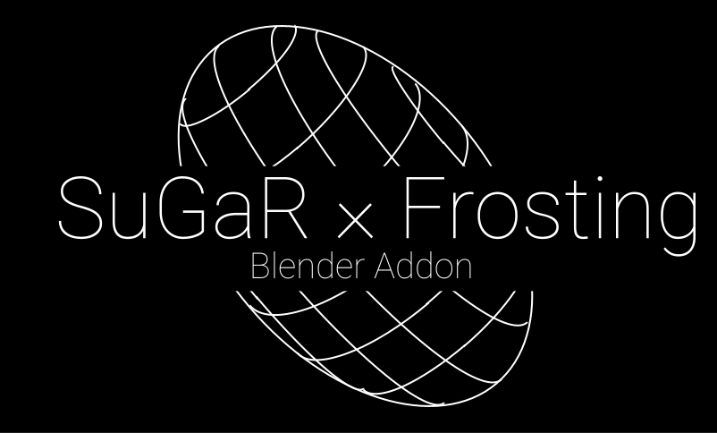
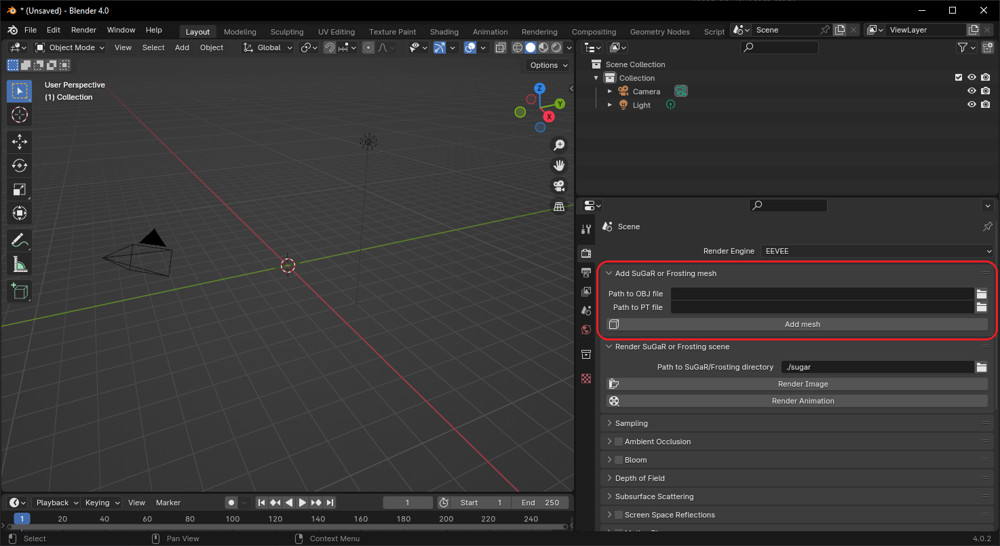
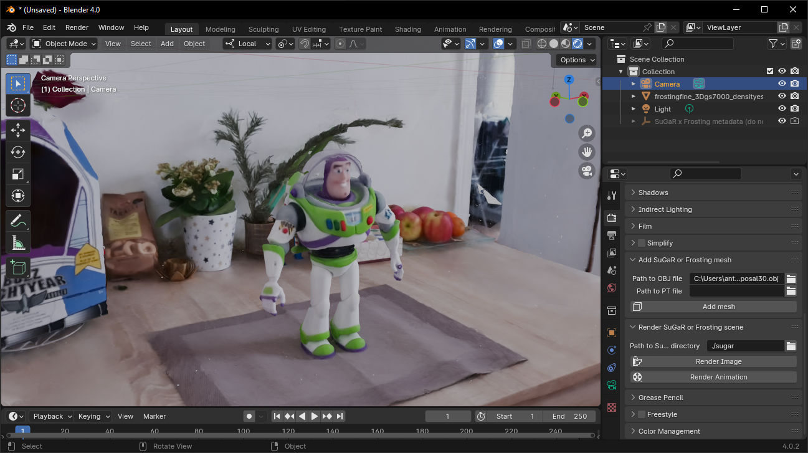
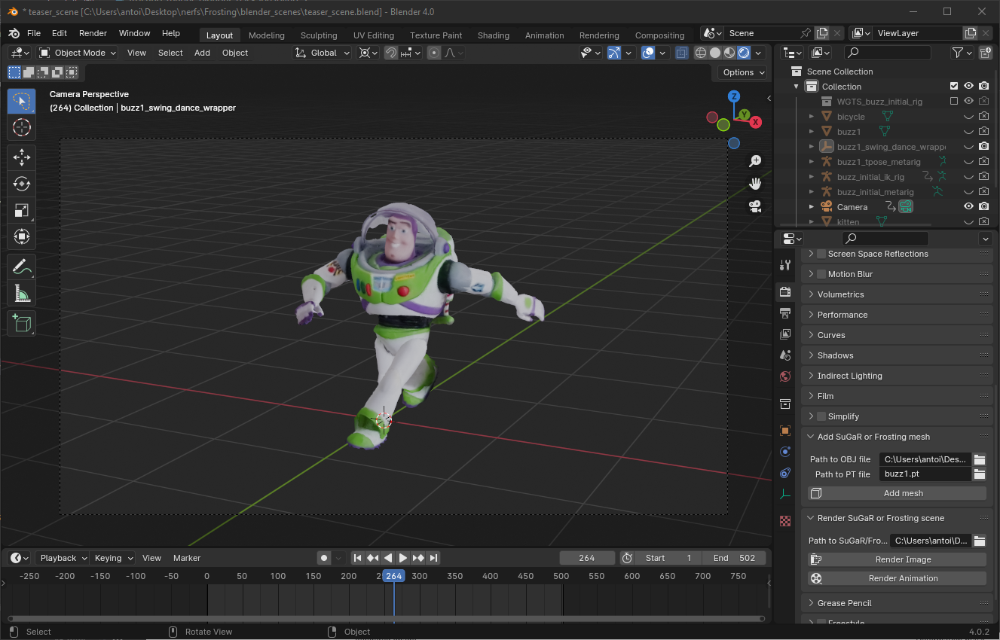
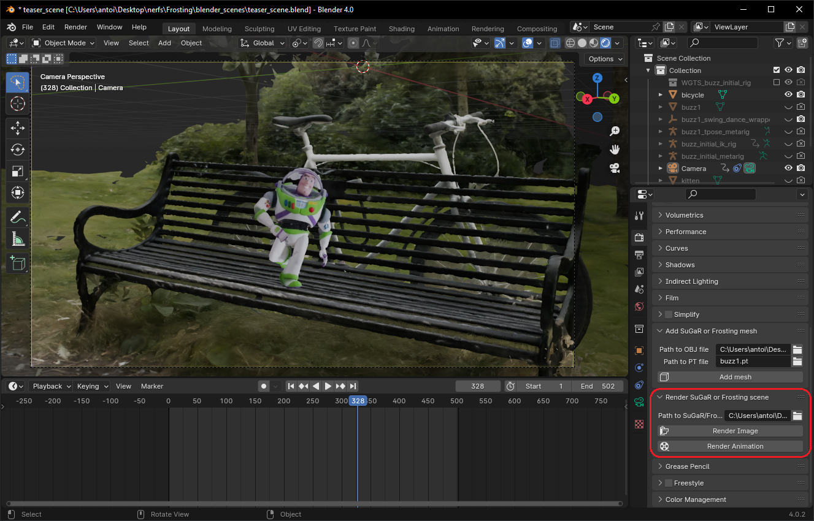

<div align="center">



<font size="4">
<a href="https://anttwo.github.io/" style="font-size:100%;">Antoine Guédon</a>&emsp;
<a href="https://vincentlepetit.github.io/" style="font-size:100%;">Vincent Lepetit</a>&emsp;
</font>
<br>

<font size="4">
LIGM, Ecole des Ponts, Univ Gustave Eiffel, CNRS
</font>
<br>
| <a href="https://anttwo.github.io/sugar/">SuGaR web page</a> | <a href="https://anttwo.github.io/frosting/">Frosting web page</a> | <a href="https://anttwo.github.io/">Tutorial video (coming soon)</a> |

</div>

<br>

<h1>Installation</h1>

1. Please start by cloning this repo.<br>

2. Then, install <a href="https://www.blender.org/download/">Blender</a> (version 4.0.2 is recommended but not mandatory).<br>

3. Open Blender, and go to `Edit` > `Preferences` > `Add-ons` > `Install`, and select the file `sugar_addon.py` located in this repo.<br>

You have now installed the SuGaR x Frosting addon for Blender!

<h1>Usage</h1>

1. Please start by installing either <a href="https://github.com/Anttwo/SuGaR">SuGaR</a> or <a href="https://github.com/Anttwo/Frosting">Gaussian Frosting</a> from the respective repositories.

2. Follow the instructions from the repositories to optimize a SuGaR or Frosting model.

3. Open a new scene in Blender, and go to the `Render` tab in the Properties. You should see a panel named `Add SuGaR or Frosting mesh`. The panel is not necessary at the top of the tab, so you may need to scroll down to find it. <br><br>
<div align="center">
<br>
<font size="2"><i>
Use the `Add SuGaR or Frosting mesh` panel to load a mesh <br>reconstructed with SuGaR or Frosting in Blender.
</i></font>
</div>
<br>

4. **(a) Select a mesh.** Enter the path to the final mesh extracted from SuGaR or Frosting in the `Path to OBJ file` field. You can also click on the folder icon to select the file. The mesh should be located in `SuGaR/output/refined_mesh/<YOUR SCENE NAME>` or in `Frosting/output/refined_frosting_base_mesh/<YOUR SCENE NAME>` depending on the model you used.<br><br>
**(b) Select a checkpoint.** Similarly, enter the path to the final checkpoint of the optimization in the `Path to PT file` field. You can also click on the folder icon to select the file. The checkpoint should be located in `SuGaR/output/refined/<YOUR SCENE NAME>` or in `Frosting/output/refined_frosting/<YOUR SCENE NAME>` depending on the model you used.<br><br>
**(c) Load the mesh.** Finally, click on `Add mesh` to load the mesh in Blender. Feel free to rotate the mesh and change the shading mode to better visualize the mesh and its colors. 
<br><br>
<div align="center">
<br>
<center><font size="2"><i>
Please rotate the mesh and change the shading mode to get a better view of the mesh.
</i></font></center>
</div>
<br>

5. **Now, feel free to edit your mesh using Blender!** 
<br>You can segment it into different pieces, sculpt it, rig it, animate it using a parent armature, *etc*. You can also add other SuGaR or Frosting meshes to the scene, and combine elements from different scenes. <br>
Feel free to set a camera in the scene and prepare an animation: You can animate the camera, the mesh, *etc*.<br>
Please avoid using `Apply Location`, `Apply Rotation`, or `Apply Scale` on the edited mesh, as I am still not sure how it will affect the correspondence between the mesh and the optimized checkpoint.
<br><br>
<div align="center">
<br>
<center><font size="2"><i>
You can edit the mesh as you want, and prepare an animation with it.<br>
You can also add other SuGaR or Frosting meshes to the scene.
</i></font></center>
</div>
<br>

6. Once you're done with your editing, you can prepare a rendering package ready to be rendered with SuGaR or Frosting. To do so, go to the `Render` tab in the Properties again, and select the main directory of your model in the `Path to SuGaR/Frosting directory` field.
If you installed the repo of SuGaR or Frosting from GitHub, this directory should be named either `SuGaR` or `Frosting`.<br> 
Finally, click on `Render Image` or `Render Animation` to render the scene. 
<br><br>
<div align="center">
<br>
<center><font size="2"><i>
In this example, we first animated the camera and the character. <br>
Then, we added another Frosting mesh to get a background for our character.
</i></font></center>
</div>
<br>

`Render Image` will render a single image of the scene, with the current camera position and mesh editions/poses.<br><br>
`Render Animation` will render a full animation of the scene, from the first frame to the last frame you set in the Blender Timeline.
<br><br>
The package should be located in `<SuGaR or Frosting>/blender/packages/`.

7. Finally, you can render the package with SuGaR or Frosting. You just need to go to the root directory of the SuGaR or Frosting repo and run the following command:
```shell
python render_blender_scene.py -p <PATH TO PACKAGE>
```

<div align="center">
<br>
<center><font size="2"><i>
With SuGaR or Frosting, you can get a realistic, high-quality rendering of your scene!
</i></font></center>
</div>
<br>

Please check the documentation of SuGaR or Frosting for more information on the additional arguments of the script.
If you get artifacts in the rendering, you can try to switch the automatic adjustment method of the Gaussians from 'complex' to 'simple':
```shell
python render_blender_scene.py -p <PATH TO PACKAGE> --adaptation_method simple
```